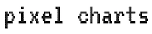

Simple charting library with lines between values represented as series of boxes and 0 runtime dependencies.


## Installation

```
npm install pixel-charts --save
```

## Example

```javascript
import chart from 'pixel-charts';

function exampleUsage() {
  const options = {
    // Y axis is scaled to match these values
    data: [10, 15, 30, 60],
    // Optional
    height: 400,
    // Optional
    increment: 10,
    // Optional
    chartId: 'example-chart'
  };

  chart(options);
}

window.onload = exampleUsage;
```

Check out [the full example](example) for more.

## Why?

I wanted "retro looking" charts for [a stock tracker](https://github.com/bbohen/re-robinhood) I'm working on and didn't really see any options. This led to me trying to figure out what a "retro looking" chart even is (still trying to make it look better, help is welcome). I think there are possibly some cool ways to visualize and animate data with boxes instead of lines.
